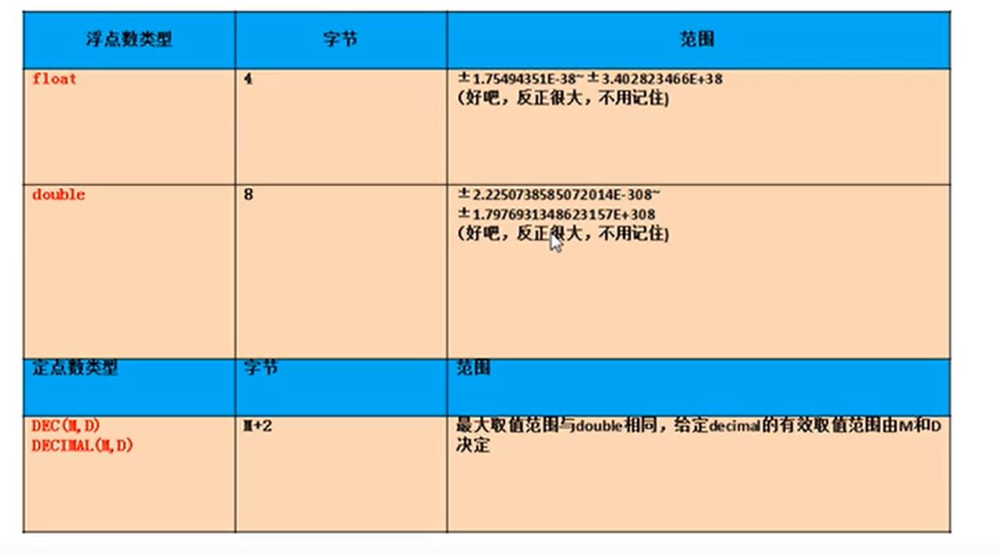

# SQL学习笔记12——SQL中数据定义语言DDL
## 库的管理
创建、修改、删除
1. 库的创建
	语法
	```sql
	create database 【if not exists】 库名【 character set 字符集名】;
	```
2. 库的修改
	* 库名的修改：只能关闭mysql服务，找到库所在文件夹，右键重命名，然后重启mysql服务。一般都不去修改库名
	* 更改库的字符集
	```sql
	alter database 库名 character set 字符集名;
	```
3. 库的删除
	```sql
	drop database 【if exists】 库名;
	```
## 表的管理
创建：create、修改：alter、删除：drop
### 表的创建 ★
语法：
```sql
create table 【if not exists】 表名(
	字段名 字段类型 【(长度)约束】,
	字段名 字段类型 【(长度)约束】,
	...
	字段名 字段类型 【(长度)约束】 
);
```
案例：
* 创建表book
```sql
CREATE TABLE 【IF NOT EXISTS】 book(
	id INT, #编号
	bname VARCHAR(20), #图书名,VARCHAR(20)表示最大字符长度为20，注意不是字节长度，一个汉字和一个子母的字符长度都是1
	price DOUBLE, #价格
	authorID INT, #作者编号
	publishDate DATETIME #出版日期
);
/*
这样不带约束创建的表，每个字段的值都是可以为NULL，而且一些默认值也是NULL
*/
```
### 表的修改
一般语法
```sql
alter table 表名 add|drop|modify|change column 列名 【列类型/约束】;
```
1. 修改列名
例子
```sql
ALTER TABLE book CHANGE [COLUMN] publishdate pubdate DATETIME;#这里其实可以修改列的类型/约束
```
2. 修改列的类型或约束
例子
```sql
ALTER TABLE book MODIFY COLUMN pubdate TIMESTAMP;
```
3. 添加新列
例子
```sql
ALTER TABLE book ADD COLUMN annual DOUBLE;
```
4. 删除列
例子
```sql
ALTER TABLE book DROP COLUMN annual;
```
5. 修改表名
例子
```sql
ALTER TABLE book RENAME TO book_new;
```
### 表的删除
例子
```sql
DROP TABLE [IF EXISTS] book;
#库和表的创建和删除才可以用IF [NOT] EXISTS，列的创建和删除不行
```

### 表的复制
1. 仅仅复制表的结构
例子
```sql
CREATE TABLE copy LIKE author;
```
2. 复制表的结构+数据
例子
```sql
CREATE TABLE copy2
SELECT * FROM book;
```
3. 复制表的部分结构+部分数据
例子
```sql
CREATE TABLE copy3
SELECT id,bname
FROM book
WHERE authorID = 1;
```
4. 仅仅复制某些字段，不带数据
例子
```sql
CREATE TABLE copy3
SELECT id,bname
FROM book
WHERE 1=2;
/*
或者WHERE 1=2改为WHERE 0
*/
```
## 数据类型
### 常见的数据类型
* 数值型
	* 整数
	* 小数：定点数、浮点数
* 字符型
	* 较短的文本：char、varchar
	* 较长的文本：text、blob(较长的二进制数据如图片)
* 日期型

#### 整型
整数类型|tinyint|smallint|mediumint|int/integer|bigint|
-|-|-|-|-|-|
字节（1字节8位）|1|         2 |       3 |         4   |         8|

特点
* 都可以设置无符号和有符号，默认有符号，通过unsigned设置无符号
* 如果超出了范围，会报out or range异常，插入临界值
* 长度可以不指定，默认会有一个长度
* 长度代表显示的最大宽度，如果不够则左边用0填充，但需要搭配zerofill，并且默认变为无符号整型

#### 小数
##### 分类

1. 浮点型
	float(M,D)   4
	double(M,D)  8
2. 定点型
	dec(M,D)
	decimal(M,D)
##### 特点：
* ①M代表整数部位+小数部位的个数，D代表小数部位
* ②如果超出范围，则报out or range异常，并且插入临界值
* ③M和D都可以省略，但对于定点数，M默认为10，D默认为0，如果是float和double，则会根据插入的数值的精度来决定精度
* ④如果精度要求较高，则优先考虑使用定点数
* 原则：所选择的类型越简单越好，能保存数值的类型越小越好

#### 字符型
char、varchar、binary、varbinary、enum、set、text、blob
||写法|M的意思|特点|空间的耗费|效率
-|-|-|-|-|-|
char|char(M)|最大的字符数，可以省略，默认为1|固定长度的字符(如'中国'在char(10)中是10个字符)|比较耗费|高
varchar|varchar(M)|最大的字符数，不可以省略|可变长度的字符(如'中国'在varchar(10)中仍然是2个字符)|比较节省|低

enum举例
```sql
CREATE TABLE tab_char(
	c1 ENUM('a','b','c')
);
INSERT INTO tab_char VALUES('a');
INSERT INTO tab_char VALUES('b');
INSERT INTO tab_char VALUES('c');
INSERT INTO tab_char VALUES('d');#报错，值会以空白替代
```
其他的特点:
* binary和varbinary用于保存较短的二进制
* enum用于保存枚举
* set用于保存集合，和enum类似，不同之处在于enum每次只能选一个，set可以选任意子集

#### 日期型
- year 年
- date 日期
- time 时间
- datetime 日期+时间，8字节，范围大(1000年-9999年)，不受时区影响   
- timestamp(时间戳) 日期+时间，4字节，范围小(1970年-2038年)，比较容易受时区、语法模式、版本的影响，更能反映当前时区的真实时间
## 常见约束
### 含义
一种限制，用于限制表中的数据，为了保证表中的数据的准确和可靠性
### 分类
- NOT NULL：非空，该字段的值必填，用于保证该字段的值不能为空，比如姓名、学号等
- UNIQUE：唯一，该字段的值不可重复，用于保证该字段的值具有唯一性，但可以为空
- DEFAULT：默认，该字段的值不用手动插入就有默认值
- CHECK：检查约束，mysql中不支持，比如检查年龄大于18小于60等等
- PRIMARY KEY：主键，该字段的值不可重复并且非空，用于保证该字段的值具有唯一性，比如学号、员工编号等，等价于unique+not null
- FOREIGN KEY：外键，该字段的值引用了另外的表的字段，用于限制两个表的关系，用于保证该字段的值必须来自于主表的关联列的值，在从表中添加外键约束，用于引用主表中某列的值，比如学生表的专业编号，员工表的部门编号，员工表的工种编号等等

### 添加约束的时机
1. 创建表时
2. 修改表时
### 约束添加的分类
1. 列级约束：六大约束语法上都支持，但外键约束没有效果
	* 语法：创建表时直接在列名后面加，也可以加多个约束，用空格分隔即可
2. 表级约束：除了非空，默认，其他的都支持
	* 语法：创建表时在各个字段的最下面：【constraint 约束名】 约束类型(字段名)
### 语法
1. 创建表时添加约束
```sql
# 添加列级约束
CREATE TABLE stuinfo(
	id INT PRIMARY KEY,#主键
	stuname VARCHAR(20) NOT NULL,#非空
	gender CHAR(1) CHECK(gender='男' OR gender='女'),#检查
	seat INT UNIQUE,#唯一
	age INT DEFAULT 18,#默认
	majorid INT REFERENCES major(id)#外键，不过这样是没有效果的
);

CREATE TABLE major(
	id INT PRIMARY KEY,#主键
	majorname VARCHAR(20)
);
# 添加表级约束
CREATE TABLE stuinfo(
	id INT,
	stuname VARCHAR(20),
	gender CHAR(1),
	seat INT,
	age INT,
	majorid INT,
	CONSTRAINT pk PRIMARY KEY(id),#主键,这里改名的pk不起效果，后边的改名都起效果
	CONSTRAINT uq UNIQUE(seat),#唯一
	CONSTRAINT ck CHECK(gender='男' OR gender='女'),#检查
	CONSTRAINT fk_stuinfo_major FOREIGN KEY(majorid) REFERENCES major(id)#外键
);

CREATE TABLE major(
	id INT PRIMARY KEY,#主键
	majorname VARCHAR(20)
);

#通用的写法
CREATE TABLE IF NOT EXISTS stuinfo(
	id INT PRIMARY KEY,
	stuname VARCHAR(20) NOT NULL,
	gender CHAR(1),
	age INT DEFAULT 18,
	seat INT UNIQUE,
	majorid INT,
	CONSTRAINT fk_stuinfo_major FOREIGN KEY(majorid) REFERENCES major(id)
);

CREATE TABLE major(
	id INT PRIMARY KEY,#主键
	majorname VARCHAR(20)
);
```
```sql
DESC stuinfo;#可以查看一些约束信息，但是不包含外键
SHOW INDEX FROM stuinfo;#查看stuinfo表中所有的索引，包括主键、外键、唯一
```
2. 修改表时添加约束
	- 添加列级约束
	```sql
	alter table 表名 modify column 字段名 字段类型 新约束;
	```
	- 添加表级约束
	```sql
	alter table 表名 add [constraint 约束名] 约束类型(字段名) [外键的引用];
	```
例子：
```sql
CREATE TABLE stuinfo(
	id INT,
	stuname VARCHAR(20),
	gender CHAR(1),
	seat INT,
	age INT,
	majorid INT
);
#添加非空约束
ALTER TABLE stuinfo MODIFY COLUMN stuname VARCHAR(20) NOT NULL;

#添加默认约束
ALTER TABLE stuinfo MODIFY COLUMN age INT DEFAULT 18;

#添加主键
##1.列级约束
ALTER TABLE stuinfo MODIFY COLUMN id INT PRIMARY KEY;
##2.表级约束
ALTER TABLE stuinfo ADD PRIMARY KEY(id);

#添加唯一键
##1.列级约束
ALTER TABLE stuinfo MODIFY COLUMN seat INT UNIQUE;
##2.表级约束
ALTER TABLE stuinfo ADD UNIQUE(seat);

#添加外键
ALTER TABLE stuinfo ADD CONSTRAINT fk_stuinfo_major FOREIGN KEY(majorid) REFERENCES major(id);
```
3. 修改表时删除约束
```sql
#删除非空约束
ALTER TABLE stuinfo MODIFY COLUMN stuname VARCHAR(20) NULL;

#删除默认约束
ALTER TABLE stuinfo MODIFY COLUMN age INT;

#删除主键
##ALTER TABLE stuinfo MODIFY COLUMN id INT;这样子删除不了主键
ALTER TABLE stuinfo DROP PRIMARY KEY;

#删除唯一键
##ALTER TABLE stuinfo MODIFY COLUMN seat INT;这样子删除不了唯一键
ALTER TABLE stuinfo DROP INDEX seat;#seat是唯一键的键名

#删除外键
ALTER TABLE stuinfo DROP FOREIGN KEY fk_stuinfo_major;
```
### 主键和唯一的对比
||保证唯一性|是否允许为NULL|一个表中可以有多少个|是否允许组合多个列形成(此时需要通过表级约束创建，多个列之间逗号以逗号分隔)|
|-|-|-|-|-|
主键|YES|NO|至多1个|YES,但不推荐|
唯一|YES|YES,且可以多个重复的NULL|可以有多个|YES,但不推荐|

### 外键的特点
1. 要求在从表设置外键关系
2. 从表的外键列的类型和主表的关联列的类型要求一致或兼容，名称无要求
3. 主表中的关联列必须是一个key（主键、唯一、外键，一般是主键或唯一）
4. 插入数据时，先插入主表，再插入从表（创建表时也有这个要求），否则无法插入数据(相应地，创建表)，会报错
5. 删除数据时，先删除从表、再删除主表，否则无法删除，会报错

## 标识列(自增长列)
含义：不用手动插入值，可以自动提供序列值，默认从1开始，步长为1
```sql
show variables like '%auto_increment%';
#会展示两个值,一个是auto_increment_increment代表步长，改这个值有效果
#另一个是auto_increment_offset代表起始位置，但在mysql中改这个值没有效果
```
* 如果要更改起始值：手动插入值
* 如果要更改步长：更改系统变量set auto_increment_increment=值;
### 特点
1. 标识列必须和主键搭配吗？不一定，但要求必须是一个key
2. 一个表可以有几个标识列？至多一个
3. 标识列的类型只能是数值型
### 设置标识列
1. 创建表时设置标识列
```sql
CREATE TABLE tab_identity(
	id INT PRIMARY KEY AUTO_INCREMENT,
	name VARCHAR(20)
);
```
2. 修改表时设置标识列
```sql
ALTER TABLE tab_identity MODIFY COLUMN id INT PRIMARY KEY AUTO_INCREMENT;
```
3. 修改表时删除标识列
```sql
ALTER TABLE tab_identity MODIFY COLUMN id INT;
```