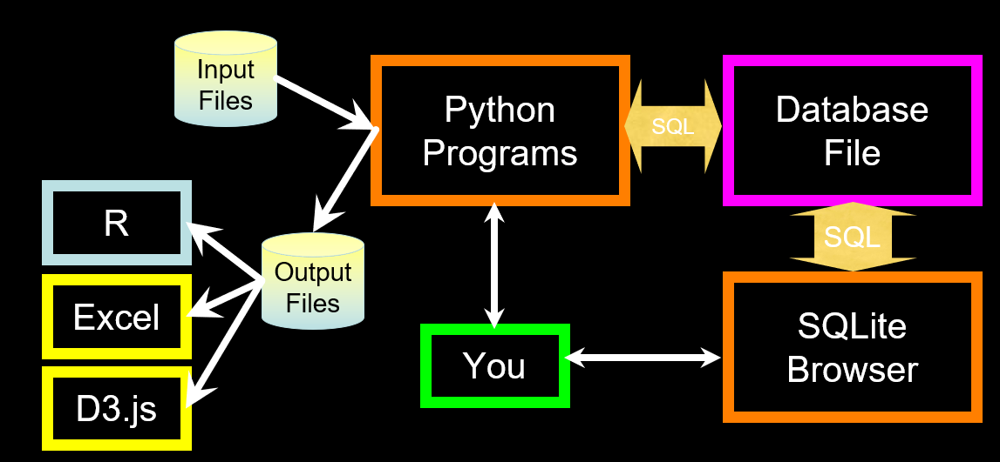

# python笔记10——Relational Databases and SQLite
## Relational Databases
* Relational databases model data by storing rows and columns in tables.  The power of the relational database lies in its ability to efficiently retrieve data from those tables and in particular where there are multiple tables and the relationships between those tables involved in the query.
* Terminology
	* Database - contains many tables
	* Relation (or table) - contains tuples and attributes
	* Tuple (or row) - a set of fields that generally represents an “object” like a person or a music track
	* Attribute (also column or field) - one of possibly many elements of data corresponding to the object represented by the row
### SQL
* Structured Query Language is the language we use to issue commands to the database
	* Create data (a.k.a Insert)
	* Retrieve data
	* Update data
	* Delete data

* Web Applications w/ Databases
	* Application Developer - Builds the logic for the application, the look and feel of the application - monitors the application for problems
	* Database Administrator - Monitors and adjusts the database as the program runs in production
	* Often both people participate in the building of the “Data model”
* Database Administrator
	* A database administrator (DBA) is a person responsible for the design, implementation, maintenance, and repair of an organization’s database. The role includes the development and design of database strategies, monitoring and improving database performance and capacity, and planning for future expansion requirements. They may also plan, coordinate, and implement security measures to safeguard the database.
* Database Model
	* A database model or database schema is the structure or format of a database, described in a formal language supported by the database management system. In other words, a “database model” is the application of a data model when used in conjunction with a database management system.
* Common Database Systems
	* Three major Database Management Systems in wide use
		* Oracle - Large, commercial, enterprise-scale, very very tweakable
		* MySql - Simpler but very fast and scalable - commercial open source
		* SqlServer - Very nice - from Microsoft (also Access)
	* Many other smaller projects, free and open source
		* HSQL, SQLite, Postgres, ... 
### 案例
1. 从文件中记录各个email出现次数，并写入sqlite数据库
	```python
	import sqlite3
	conn = sqlite3.connect('emaildb.sqlite')
	cur = conn.cursor()
	cur.execute('DROP TABLE IF EXISTS Counts')
	
	cur.execute('''
	CREATE TABLE Counts (email TEXT, count INTEGER)''')
	
	fname = input('Enter file name: ')
	if (len(fname)<1): fname = 'mbox-short.txt'
	fh = open(fname)
	for line in fh:
	    if not line.startswith('From: '): continue
	    pieces = line.split()
	    email = pieces[1]
	    cur.execute('SELECT count FROM Counts WHERE email = ? ',(email,)) #注意这里(email,)是元组,它和单独一个变量email有区别
	    row = cur.fetchone()
	    if row is None:
	        cur.execute('''INSERT into Counts (email,count)
	            VALUES(?,1)''', (email,))
	    else:
	        cur.execute('UPDATE Counts SET count = count + 1 WHERE email = ?',
	                    (email,))
	    conn.commit()
	
	sqlstr = 'SELECT email,count FROM Counts ORDER BY count DESC LIMIT 10'
	
	for row in cur.execute(sqlstr):
	    print(str(row[0]),row[1])
	    
	conn.close() #或者用cur.close()
	```
	* 注记：关于sqlite3的使用可以参考[sqlite3的使用](https://www.runoob.com/sqlite/sqlite-python.html)
	* DB browser for SQLite是很好的SQLite可视化客户端，自带了SQLite
	* mysql也可以实现类似效果，不过是采用另外的包，如pymysql等
	* 结合爬虫，可以将爬虫得到的数据写入数据库
## Summary
* Relational databases allow us to scale to very large amounts of data
* The key is to have one copy of any data element and use relations and joins to link the data to multiple places
* This greatly reduces the amount of data which much be scanned when doing complex operations across large amounts of data
* Database and SQL design is a bit of an art form
