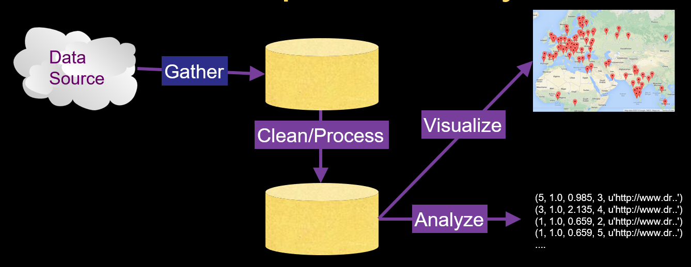

# python笔记11——Retrieving and Visualizing Data

## Many Data Mining Technologies
* https://hadoop.apache.org/
* http://spark.apache.org/
* https://aws.amazon.com/redshift/
* http://community.pentaho.com/
* ...
## ...

## 以后有空再看这个视频，并查阅其他资料学习，暂时跳过
* PageRank 可视化
* Word Cloud 词云可视化